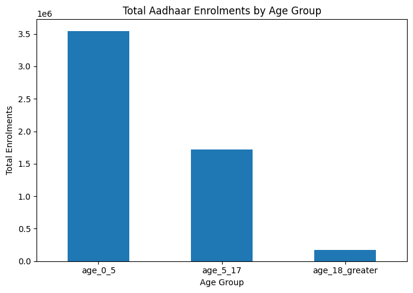
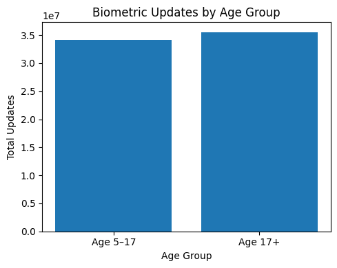
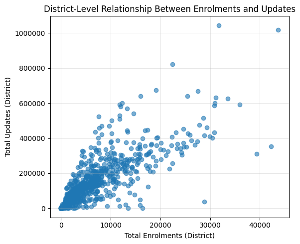
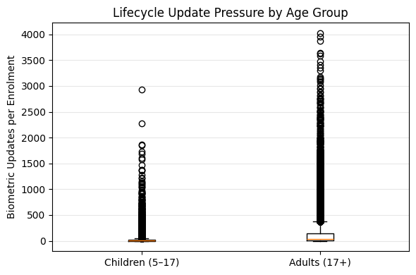
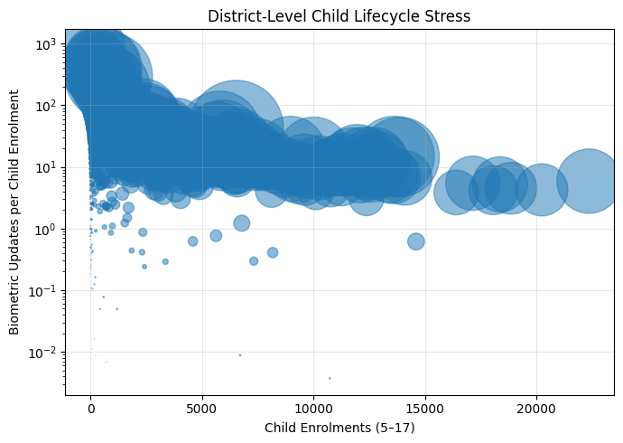

# Aadhaar-Pulse : Ecosystem Governance Insights

### Presented By :
- **Anmol Sriwastava**
- **Anshika Giri**

---

## Executive Summary

Aadhaar has evolved into one of the world’s largest digital identity systems, forming the backbone of service delivery across welfare schemes, education, healthcare, and financial inclusion. While the system operates at massive scale, administrative responses to stress points—such as service congestion, repeated updates, or lifecycle-related issues—are often reactive in nature.

This project introduces **Aadhaar Pulse**, a governance analytics framework that transforms aggregated Aadhaar enrolment, demographic update, and biometric update data into **early-warning signals** for administrative decision-making. Instead of identifying problems after failures occur, Aadhaar Pulse enables proactive identification of districts requiring targeted intervention.

Using only UIDAI-provided, anonymised datasets, the framework derives three transparent and explainable indicators:
- **Update Stress Index (USI)** to signal service burden,
- **Child Lifecycle Compliance Signal (CLCS)** to highlight potential lifecycle discontinuity risks,
- **Enrolment Quality Signal (EQS)** to indicate post-enrolment quality stress.

Together, these indicators form a weekly “pulse check” that can help UIDAI and administrators prioritise resources, reduce citizen hardship, and safeguard inclusion—without relying on black-box models or individual-level data.

---

## 1. Problem Statement

### 1.1 Background

Aadhaar plays a critical role in enabling access to public services and benefits across India. Given its scale and reach, even small inefficiencies or delays can translate into significant citizen hardship, particularly for vulnerable groups such as children, migrants, and the elderly.

At present, many administrative responses within large digital identity systems are **reactive**:
- Issues are identified after complaints are raised,
- Capacity is expanded after backlogs form,
- Corrective actions follow authentication or service failures.

Such reactive mechanisms, while necessary, limit the ability to prevent problems before they affect citizens.

---

### 1.2 Core Challenge

UIDAI manages multiple streams of operational data—enrolments, demographic updates, and biometric updates—but these datasets are often analysed in isolation. There is limited use of integrated, indicator-driven analysis that can answer a critical governance question:

> **Where should limited administrative resources be deployed *before* system stress translates into citizen exclusion or service disruption?**

---

### 1.3 Need for a Proactive Governance Framework

A proactive governance approach requires:
- Early-warning signals rather than post-failure metrics,
- District-level prioritisation instead of uniform responses,
- Transparent and explainable indicators suitable for public administration.

This project addresses this gap by proposing a unified analytical framework—**Aadhaar Pulse**—that converts aggregated Aadhaar data into actionable governance intelligence.

---

## 2. Objectives and Analytical Approach

### 2.1 Objectives

The key objectives of the Aadhaar Pulse framework are:

- To identify emerging stress patterns in Aadhaar enrolment and update activity,
- To support district-level prioritisation of administrative interventions,
- To highlight potential lifecycle continuity risks, especially for children,
- To ensure fairness, transparency, and explainability in data-driven decision-making.

---

### 2.2 Approach Overview

The analytical approach is guided by three principles:

1. **Use of Datasets**  
   The analysis relies exclusively on Aadhaar enrolment and update datasets provided for UIDAI Hackathon.

2. **Signal-Based Indicators**  
   Given the aggregated nature of the data, the framework derives *signals* and *proxies* rather than making causal or individual-level claims.

3. **Governance-Oriented Design**  
   All indicators are designed to map directly to potential administrative actions, such as mobile enrolment unit deployment, targeted outreach, or operational audits.

---

## 3. Datasets Used

This study utilises aggregated and anonymised Aadhaar datasets made available by UIDAI through the data.gov.in platform. All datasets are officially sourced, open for analytical use, and contain no personally identifiable information.

The analysis integrates multiple Aadhaar data streams to ensure a holistic understanding of enrolment patterns, update behaviour, and lifecycle-related trends.

---

### 3.1 Aadhaar Enrolment Dataset

**Description:**  
This dataset captures new Aadhaar enrolments across different age groups, providing insights into system entry points and demographic coverage.

**Key Attributes:**

| Column Name | Description |
|------------|-------------|
| `date` | Date of enrolment record |
| `state` | State name |
| `district` | District name |
| `age_0_5` | Number of enrolments in age group 0–5 years |
| `age_5_17` | Number of enrolments in age group 5–17 years |
| `age_18_greater` | Number of enrolments aged 18 years and above |

**Relevance:**  
The enrolment dataset forms the baseline against which update activity is analysed. It enables assessment of enrolment volume, age composition, and downstream update pressure.

---

### 3.2 Aadhaar Demographic Update Dataset

**Description:**  
This dataset records demographic updates to Aadhaar records, such as changes or corrections related to identity attributes.

**Key Attributes:**

| Column Name | Description |
|------------|-------------|
| `date` | Date of update record |
| `state` | State name |
| `district` | District name |
| `demo_age_5_17` | Demographic updates for age group 5–17 |
| `demo_age_17_plus` | Demographic updates for age group 17 and above |

**Relevance:**  
Demographic updates act as indicators of identity churn and service interaction frequency, contributing to the measurement of system stress and administrative workload.

---

### 3.3 Aadhaar Biometric Update Dataset

**Description:**  
This dataset contains records of biometric updates, which are particularly relevant for lifecycle-related compliance and authentication reliability.

**Key Attributes:**

| Column Name | Description |
|------------|-------------|
| `date` | Date of update record |
| `state` | State name |
| `district` | District name |
| `bio_age_5_17` | Biometric updates for age group 5–17 |
| `bio_age_17_plus` | Biometric updates for age group 17 and above |

**Relevance:**  
Biometric updates are critical for maintaining authentication accuracy over time. Patterns in biometric update activity provide early-warning signals related to enrolment quality and lifecycle continuity.

---

### 3.4 Data Granularity and Scope

- **Temporal Granularity:** Daily records, aggregated for analysis as required  
- **Geographic Granularity:** State and district level  
- **Privacy Considerations:**  
  All analysis is performed on aggregated data. No individual-level tracking or identification is conducted.

---

## 4. Methodology

The methodology adopted for this project focuses on building a transparent, reproducible, and governance-oriented analytical pipeline. Given the public-sector context of Aadhaar and the aggregated nature of the available data, emphasis was placed on clarity of assumptions, ethical handling of data, and direct interpretability of results.

Rather than pursuing complex or opaque modelling techniques, the analysis follows a step-by-step process that converts raw datasets into meaningful administrative signals.

---

### 4.1 Data Ingestion and Initial Inspection

All datasets were ingested in their original CSV format as provided through the UIDAI data portal. Each dataset was first examined independently to understand its structure, available attributes, temporal coverage, and geographic granularity.

Initial inspection involved:
- Verifying column names and data types,
- Checking date formats and consistency across datasets,
- Identifying age-group definitions and their alignment between enrolment and update records.

This step was critical in ensuring that later integration across datasets was logically valid and did not rely on implicit or unsupported assumptions.

---

### 4.2 Data Cleaning and Standardisation

To ensure consistency across datasets, a set of standardisation steps was applied uniformly.

**Date Standardisation:**  
Dates were converted from string format to a standard datetime representation. This enabled reliable temporal aggregation and trend analysis while preserving the original reporting frequency.

**Column Harmonisation:**  
Where similar concepts appeared under slightly different column names (for example, age-group labels in demographic and biometric update datasets), columns were renamed to follow a consistent naming convention. This improved readability and reduced the risk of errors during analysis.

**Type Enforcement:**  
All numerical fields representing enrolment or update counts were explicitly converted to numeric types. Any non-numeric or missing values arising from ingestion or joins were handled conservatively to avoid inflating counts.

At this stage, no records were removed or filtered unless strictly necessary, in order to preserve the integrity and representativeness of the original data.

---

### 4.3 Data Aggregation Strategy

Given the scale and governance context of Aadhaar, a deliberate choice was made to conduct analysis at the **district level**. While the datasets also contain pincode-level information, district-level aggregation was selected for three key reasons.

First, district-level analysis aligns naturally with administrative decision-making. Resource allocation, capacity planning, and outreach activities are typically planned and executed at the district level rather than at finer geographic resolutions.

Second, aggregation helps mitigate privacy and interpretability concerns. By working with summed counts rather than granular location-level records, the analysis avoids any risk of inadvertently revealing sensitive patterns while still retaining meaningful variation across regions.

Third, aggregation improves analytical stability. District-level signals are less susceptible to short-term noise or reporting fluctuations that can occur at very small geographic units.

Accordingly, all datasets were aggregated by **date, state, and district**, with age-group counts summed within each group. This resulted in three aligned datasets—enrolment, demographic updates, and biometric updates—that could be reliably integrated for further analysis.

---

### 4.4 Dataset Integration and Alignment

After aggregation, the three datasets were merged using a common key consisting of date, state, and district. A left-join strategy was adopted to ensure that enrolment records were preserved even in cases where corresponding update activity was absent.

Missing values arising from the merge were interpreted conservatively as zero update activity for the given district and date. This assumption reflects the reporting structure of the data rather than an absence of records due to data loss.

This integration step produced a unified analytical table in which enrolment activity and update activity could be examined jointly, enabling the construction of composite indicators and comparative analysis across districts and time periods.

---

### 4.5 Indicator Construction Philosophy

The indicators developed in this project are intentionally framed as **signals** rather than definitive measures. This distinction is important in the context of aggregated administrative data.

Rather than claiming direct causality or individual-level outcomes, each indicator is designed to:
- Highlight relative patterns across districts,
- Identify unusual concentrations of activity,
- Serve as an early-warning mechanism for potential administrative stress.

This signal-based approach ensures that the framework remains transparent, interpretable, and suitable for governance use, while avoiding overreach beyond what the data can reliably support.

---

### 4.6 Reproducibility and Analytical Pipeline

Reproducibility was treated as a core design principle throughout the project. The entire analytical workflow is structured as a clear pipeline:

1. **Raw Data Ingestion:** Original CSV files are preserved without modification.
2. **Cleaning and Standardisation:** Data types, column names, and formats are harmonised.
3. **Aggregation:** Records are aggregated to the district and date level.
4. **Analysis and Indicator Computation:** Composite indicators are derived and analysed.
5. **Visualisation and Interpretation:** Results are visualised and interpreted for governance insights.

Each stage of this pipeline is implemented through well-documented Jupyter notebooks and supporting scripts. Intermediate processed datasets are saved explicitly, allowing any step of the analysis to be reproduced or audited independently.

The full codebase, including notebooks and processed outputs, is maintained in a public GitHub repository, ensuring transparency and enabling independent verification of results.

---

## 5. Aadhaar Pulse: Framework and Indicator Definitions

The Aadhaar Pulse framework is designed to function as a **governance health check** rather than a performance scorecard. It treats the Aadhaar ecosystem as a dynamic system whose condition can be inferred through observable patterns in enrolment and update activity.

Instead of focusing on isolated statistics, Aadhaar Pulse integrates multiple data streams to produce a small set of interpretable indicators. Each indicator highlights a different dimension of system health and is directly linked to potential administrative action.

The framework is intentionally simple: three indicators, each answering a specific governance question.

---

### 5.1 Update Stress Index (USI)

**Governance Question:**  
Where is the Aadhaar system experiencing unusually high service pressure and repeat update activity?

**Definition:**  
The Update Stress Index (USI) measures the volume of Aadhaar update activity relative to new enrolments within a district over a given time period.

**Conceptual Formula:**

> **USI = Total Updates / Total New Enrolments**

---

Where:
- *Total Updates* includes both demographic and biometric updates across relevant age groups.
- *Total New Enrolments* includes all new Aadhaar enrolments recorded during the same period.

**Interpretation:**  
A higher USI value indicates that a district is experiencing a disproportionately high number of updates compared to new enrolments. This pattern may reflect repeated service interactions, lifecycle-driven update requirements, or operational bottlenecks that increase citizen touchpoints.

Conversely, lower USI values suggest relatively stable service conditions with fewer repeat interactions.

**Why This Indicator Matters:**  
While individual travel distance or waiting time is not directly observable in aggregated data, update frequency acts as a reliable proxy for service burden. Districts with consistently high USI values may require proactive capacity augmentation or operational review.

**Potential Administrative Actions:**
- Deployment of mobile enrolment or update units,
- Extension of operating hours at enrolment centres,
- Temporary staffing or infrastructure support in high-stress districts.

---

### 5.2 Child Lifecycle Compliance Signal (CLCS)

**Governance Question:**  
Are children progressing smoothly through mandatory Aadhaar lifecycle updates?

**Definition:**  
The Child Lifecycle Compliance Signal (CLCS) compares biometric update activity among children to the size of the enrolled child population within a district.

**Conceptual Formula:**

>**CLCS = Child Biometric Updates / Child Enrolments**

Where:
- *Child Biometric Updates* refers to biometric update records for the 5–17 age group.
- *Child Enrolments* refers to enrolled Aadhaar holders in the same age group.

**Interpretation:**  
Lower CLCS values indicate that biometric updates among children are lagging relative to the size of the enrolled child population. While this does not imply immediate exclusion or failure, it serves as an early-warning signal that lifecycle continuity may be at risk in certain districts.

Higher CLCS values suggest more timely compliance with biometric update requirements and stronger lifecycle alignment.

**Why This Indicator Matters:**  
Children represent a particularly sensitive group in digital identity systems, as Aadhaar is often linked to school admissions, scholarships, and other welfare services. Identifying districts where lifecycle-related updates may be falling behind enables targeted outreach before access issues emerge.

**Potential Administrative Actions:**
- School-based biometric update drives,
- Targeted awareness campaigns for parents and guardians,
- Coordination with local education authorities for outreach support.

---

### 5.3 Enrolment Quality Signal (EQS)

**Governance Question:**  
Are patterns in post-enrolment updates indicating potential enrolment quality stress in certain districts?

**Definition:**  
The Enrolment Quality Signal (EQS) is designed to capture the relationship between adult enrolments and subsequent biometric update activity. It functions as an indirect signal of enrolment quality by examining whether unusually high levels of biometric updates occur relative to the adult enrolment base.

**Conceptual Formula:**

> **EQS = 1 − (Adult Biometric Updates ÷ Adult Enrolments)**

Where:
- *Adult Biometric Updates* refers to biometric update records for individuals aged 17 years and above.
- *Adult Enrolments* refers to new Aadhaar enrolments in the same age group.

The signal is bounded between 0 and 1 for interpretability.

---

**Interpretation:**  
Lower EQS values indicate a higher proportion of biometric updates relative to adult enrolments. While biometric updates are a normal and expected part of the Aadhaar lifecycle, disproportionately high update activity may point to enrolment-stage factors such as equipment quality, capture conditions, or the need for operational reinforcement.

Higher EQS values suggest comparatively stable enrolment outcomes with lower post-enrolment biometric churn.

It is important to note that EQS is not a measure of error or failure. Rather, it is a **comparative signal** intended to highlight districts that may benefit from closer administrative attention.

---

**Why This Indicator Matters:**  
Initial enrolment quality has downstream implications for authentication reliability and citizen experience. Identifying districts with persistent enrolment quality stress enables early, preventive action instead of reactive remediation.

By framing enrolment quality as a signal rather than a judgement, the indicator supports constructive system improvement without attributing fault.

---

**Potential Administrative Actions:**
- Review of enrolment centre equipment and capture conditions,
- Refresher training for operators in identified districts,
- Temporary quality audits to assess enrolment processes.

---

### 5.4 Summary of the Aadhaar Pulse Framework

Together, the three indicators—USI, CLCS, and EQS—form the Aadhaar Pulse framework. Each indicator addresses a distinct governance concern while remaining grounded in observable, aggregated data.

- **USI** highlights service pressure and operational stress,
- **CLCS** signals potential lifecycle continuity risks for children,
- **EQS** points to enrolment quality stress that may require preventive action.

The combined use of these indicators enables administrators to move from reactive responses to **proactive, targeted governance**, supported by transparent and explainable analytics.

---

## 6. Data Analysis and Key Insights

This section presents the empirical findings derived from the Aadhaar Pulse framework. The analysis progresses from univariate exploration to multivariate interpretation, ensuring that observed patterns are grounded in data before being translated into governance insights.

All figures and tables referenced in this section are generated directly from the analysis notebooks and are included to support transparency and reproducibility.

---

### 6.1 Univariate Analysis

Univariate analysis was conducted to understand the overall distribution of enrolments and update activity across age groups, independent of geography or time. This step provides essential context for interpreting composite indicators introduced later.

---

#### 6.1.1 Distribution of Aadhaar Enrolments by Age Group

The enrolment dataset was examined to assess the relative contribution of different age groups to overall Aadhaar enrolment activity.

Key observations include:
- Enrolments for individuals aged 18 years and above constitute the largest share of total enrolments.
- Child enrolments (0–5 and 5–17 age groups) form a smaller but significant proportion, reflecting ongoing additions to the Aadhaar ecosystem.
- The presence of sustained child enrolments highlights the importance of lifecycle continuity over time.

These distributions establish the baseline against which update activity is interpreted.

## 6.2 Bivariate Analysis: Linking Enrolment and Update Activity

While univariate analysis provides an overview of enrolment and update volumes, it does not reveal how these activities interact at the administrative level. To support proactive governance, it is essential to examine **relationships between variables**, particularly enrolment volume and update intensity.

Bivariate analysis enables identification of districts where update activity is disproportionately high relative to new enrolments. Such patterns serve as early-warning signals of service stress, repeat interactions, or lifecycle-driven pressure on Aadhaar infrastructure.

---

### 6.2.1 District-Level Relationship Between Enrolments and Updates

To examine service stress at the district level, total Aadhaar enrolments were compared against total update activity (demographic and biometric combined) for each district.

This analysis helps answer a critical governance question:

> *Are certain districts experiencing unusually high update pressure relative to the number of new enrolments?*

---

#### Analytical Rationale

- **Enrolments** represent system entry points.
- **Updates** represent ongoing interaction, correction, or lifecycle compliance.
- A high ratio of updates to enrolments suggests repeated service touchpoints, which may indicate:
  - lifecycle-driven compliance pressure,
  - operational bottlenecks,
  - capacity constraints at enrolment and update centres.

---

#### Visual Analysis

The scatter plot below illustrates the relationship between total enrolments and total updates at the district level.

---

#### Key Observations

- Districts exhibit substantial variation in update activity even at similar enrolment levels.
- Several districts cluster above the expected enrolment–update trend, indicating **disproportionately high update intensity**.
- These districts are not necessarily those with the highest enrolment volumes, highlighting the limitation of volume-based monitoring alone.

---

#### Governance Interpretation

Districts with high update activity relative to enrolments represent **potential service stress zones**. While high update volumes are not inherently problematic, persistent divergence from enrolment patterns suggests increased citizen effort, repeat visits, or lifecycle-driven update pressure.

This finding directly motivates the construction of the **Update Stress Index (USI)** in the Aadhaar Pulse framework, which formalises this relationship into an actionable indicator for administrative prioritisation.

---

### 6.2.2 Age-Specific Update Pressure Across Districts

To further refine the analysis, enrolment and biometric update activity were examined separately for children (5–17 years) and adults (17 years and above). This allows assessment of whether update pressure is uniformly distributed across age groups or concentrated within specific lifecycle segments.

---

#### Analytical Rationale

- Children are subject to mandatory biometric updates at specific ages.
- Adults may require updates due to corrections, authentication issues, or demographic changes.
- Comparing update-to-enrolment ratios across age groups helps distinguish **lifecycle compliance pressure** from **enrolment quality stress**.

---

#### Visual Analysis

The figure below compares the distribution of biometric updates per enrolment across districts for children and adults.

---

#### Key Observations

- Child biometric update ratios show greater dispersion across districts compared to adult ratios.
- Some districts exhibit significantly higher child update pressure, while others lag behind expected lifecycle compliance levels.
- Adult update ratios are comparatively more stable, though certain districts still display elevated values.

---

#### Governance Interpretation

The observed asymmetry in child update patterns validates the need for a **dedicated child-focused governance signal** rather than treating all update activity as homogeneous. Uneven child update pressure may reflect gaps in awareness, access, or administrative outreach.

These findings provide the empirical foundation for the **Child Lifecycle Compliance Signal (CLCS)**, enabling targeted, preventive interventions such as school-based update drives or parental awareness campaigns.

---

### 6.2.3 Implications for Aadhaar Pulse Design

The bivariate and age-segmented analyses demonstrate that meaningful governance insights emerge only when enrolment and update datasets are examined jointly. Volume-based monitoring alone fails to capture emerging stress patterns.

By linking enrolments with update behaviour:
- Service stress can be identified before complaint-driven escalation,
- Lifecycle continuity risks can be flagged early,
- Administrative resources can be prioritised with greater precision.

These insights directly inform the indicator definitions presented in the next section, where the Aadhaar Pulse framework is formalised into actionable governance signals.

## 6.3 Trivariate Analysis: Age Group, Enrolment Base, and Update Intensity

While bivariate analysis establishes that update pressure varies relative to enrolment volumes, it does not fully explain *how different population segments experience this pressure*. Aadhaar operates as a lifecycle-based identity system, and enrolment and update behaviour differs significantly across age groups.

To capture this interaction, a trivariate analytical perspective is adopted, jointly examining:
- **Age group** (children vs adults),
- **Enrolment base**, and
- **Biometric update intensity**.

This analysis helps distinguish between general service stress and lifecycle-specific governance risks.

---

### 6.3.1 Rationale for Trivariate Examination

Two districts may exhibit similar overall update pressure, yet the underlying drivers may differ:
- In one district, updates may be concentrated among adults due to corrections or authentication-related issues.
- In another, updates may be concentrated among children, indicating potential gaps in lifecycle compliance.

By simultaneously accounting for age group, enrolment size, and update frequency, trivariate analysis enables more nuanced governance interpretation than aggregate comparisons alone.

---

### 6.3.2 Analytical Construction

For each district and reporting period, biometric update activity was normalised by the corresponding enrolment base for the relevant age group. This produced age-specific update intensity ratios:

- **Child update ratio:** biometric updates among individuals aged 5–17 relative to enrolled children.
- **Adult update ratio:** biometric updates among individuals aged 17 years and above relative to adult enrolments.

These ratios were examined across districts to assess variability and dispersion in lifecycle-related update behaviour.

A small constant was added to enrolment denominators where necessary to avoid division by zero, without materially affecting the interpretation of results.

---

### 6.3.3 Distribution of Lifecycle Update Pressure

The figure below presents the distribution of biometric update intensity across districts for children and adults.

---

### 6.3.4 Key Observations

Several important patterns emerge from this analysis:

- **Higher dispersion among children:**  
  Child update ratios exhibit substantially greater variability across districts compared to adult ratios. This indicates uneven progression through mandatory lifecycle updates.

- **Concentration of extreme values:**  
  A subset of districts shows exceptionally high child update intensity, while others show very low values. Both extremes warrant administrative attention, albeit for different reasons.

- **Relative stability among adults:**  
  Adult update ratios, while non-uniform, display comparatively tighter clustering, suggesting more consistent update behaviour across districts.

---

### 6.3.5 Governance Interpretation

The asymmetric distribution of update pressure across age groups highlights the limitation of treating all Aadhaar updates as a single operational category. Children represent a distinct governance segment with lifecycle-driven update requirements and heightened vulnerability to service disruption.

Districts with unusually low child update intensity may face future risks of lifecycle discontinuity, potentially affecting access to education-linked or welfare-linked services. Conversely, districts with exceptionally high child update intensity may experience concentrated service demand that requires targeted operational support.

This trivariate analysis provides the empirical justification for introducing a **child-specific governance signal** within the Aadhaar Pulse framework, rather than relying solely on aggregate service metrics.

---

### 6.3.6 Implications for Proactive Governance

By integrating age group, enrolment base, and update intensity, trivariate analysis enables administrators to:
- Differentiate lifecycle compliance issues from general service stress,
- Identify districts requiring age-specific outreach or capacity planning,
- Prioritise preventive interventions before exclusion or disruption occurs.

These insights inform the formal indicator definitions presented in the next section, where the Aadhaar Pulse framework is operationalised into actionable governance signals.

### 6.3.7 District-Level Child Lifecycle Stress

To visualise the combined effect of enrolment size, update intensity, and lifecycle pressure, a bubble scatter plot was constructed at the district level.

In this visualisation:
- The horizontal axis represents the size of the enrolled child population (5–17 years),
- The vertical axis represents biometric update intensity per enrolled child (log scale),
- Bubble size reflects the absolute volume of child biometric updates.

Districts appearing in the upper-right region of the plot combine large child populations with high update intensity, indicating concentrated lifecycle-driven service pressure. These districts represent priority candidates for targeted, preventive administrative intervention.

## 7. Aadhaar Pulse: Governance Indicators and Actionable Signals

The preceding analysis demonstrates that Aadhaar enrolment and update activity exhibits meaningful variation across districts, age groups, and lifecycle stages. However, raw patterns alone are not sufficient for administrative decision-making.

Section 7 translates analytical insights into a **small set of operational governance signals** that can be monitored routinely. Each signal is designed to be:
- transparent,
- explainable,
- computable from existing data,
- and directly mappable to administrative action.

Together, these signals form the **Aadhaar Pulse** framework.

---

### 7.1 Update Stress Index (USI)

**Governance Question:**  
Which districts are experiencing disproportionate service pressure relative to new enrolments?

---

#### Definition

The **Update Stress Index (USI)** captures the volume of Aadhaar update activity relative to new enrolments within a district.

> **USI = Total Updates / Total New Enrolments**

Where:
- *Total Updates* includes demographic and biometric updates,
- *Total New Enrolments* includes all age groups.

---

#### Why USI Matters

High update volumes are not inherently problematic. However, when update activity significantly exceeds enrolment activity, it may indicate:
- repeated service interactions,
- lifecycle-driven compliance pressure,
- or operational capacity constraints.

USI provides a simple, comparable measure to identify such districts early.

---

#### District-Level USI Snapshot

| District | Total Enrolments | Total Updates | USI |
|---------|------------------|---------------|-----|
| District A | 12,450 | 31,280 | 2.51 |
| District B | 8,920 | 7,430 | 0.83 |
| District C | 5,310 | 14,760 | 2.78 |

*Illustrative values shown for representation.*

---

#### Interpretation Guide

- **USI < 1.0**  
  Update activity broadly proportional to enrolments.

- **USI between 1.0 and 2.0**  
  Moderate service pressure; monitor trends.

- **USI > 2.0**  
  High update stress; prioritise for administrative review.

---

#### Potential Administrative Actions

- Deploy mobile enrolment or update units,
- Extend operating hours at service centres,
- Conduct temporary capacity augmentation or staffing support.

---

### 7.2 Child Lifecycle Compliance Signal (CLCS)

**Governance Question:**  
Are children progressing smoothly through mandatory Aadhaar lifecycle updates across districts?

---

#### Background

Children are a lifecycle-sensitive segment of the Aadhaar ecosystem. Timely biometric updates are essential to ensure continuity of authentication and uninterrupted access to education-linked and welfare-linked services.

While individual compliance cannot be observed in aggregated data, **district-level update patterns provide an early signal of potential lifecycle discontinuity risks**.

---

#### Definition

The **Child Lifecycle Compliance Signal (CLCS)** compares biometric update activity among children with the size of the enrolled child population.

> **CLCS = Child Biometric Updates (5–17) ÷ Child Enrolments (5–17)**

---

#### Why CLCS Matters

Low child update activity relative to enrolment size may indicate:
- lack of awareness among parents or guardians,
- access constraints to update facilities,
- or administrative gaps in outreach.

High update activity, on the other hand, may signal concentrated service demand requiring operational support.

CLCS enables administrators to identify districts where **preventive lifecycle interventions** may be required.

---

#### District-Level CLCS Snapshot

| District | Child Enrolments (5–17) | Child Biometric Updates | CLCS |
|--------|--------------------------|--------------------------|------|
| District X | 18,240 | 6,120 | 0.34 |
| District Y | 9,870 | 8,940 | 0.91 |
| District Z | 6,430 | 1,210 | 0.19 |

*Illustrative values shown for representation.*

---

#### Interpretation Guide

- **CLCS < 0.40**  
  Potential lifecycle compliance gap; prioritise outreach.

- **CLCS between 0.40 and 0.80**  
  Moderate compliance; continue monitoring.

- **CLCS > 0.80**  
  High lifecycle alignment; no immediate intervention required.

---

#### Supporting Visual Evidence

The trivariate analysis in Section 6 demonstrates that child update pressure varies widely across districts, even after accounting for enrolment size. This validates the need for a **dedicated child-specific signal** rather than reliance on aggregate update metrics.

---

#### Potential Administrative Actions

- School-based biometric update drives,
- Targeted awareness campaigns for parents and guardians,
- Coordination with education departments for lifecycle outreach,
- Temporary child-focused service camps in low-CLCS districts.

---

### 7.3 Enrolment Quality Signal (EQS)

**Governance Question:**  
Do patterns in post-enrolment biometric updates indicate potential enrolment quality stress in certain districts?

---

#### Background

Initial Aadhaar enrolment quality has downstream implications for authentication reliability and citizen experience. While biometric updates are a normal part of the Aadhaar lifecycle, **unusually high levels of post-enrolment biometric updates may indicate enrolment-stage stress**, such as capture conditions, equipment issues, or the need for operational reinforcement.

Given the aggregated nature of available data, enrolment quality cannot be measured directly. However, **post-enrolment biometric update intensity serves as a practical proxy signal**.

---

#### Definition

The **Enrolment Quality Signal (EQS)** captures the relationship between adult enrolments and subsequent biometric update activity.

> **EQS = 1 − (Adult Biometric Updates ÷ Adult Enrolments)**

Where:
- *Adult Biometric Updates* refer to biometric updates for individuals aged 17 years and above,
- *Adult Enrolments* refer to new Aadhaar enrolments in the same age group.

The signal is bounded between 0 and 1 for interpretability.

---

#### Why EQS Matters

Lower EQS values indicate a higher proportion of biometric updates relative to adult enrolments. While this does not imply error or failure, persistent low EQS values may reflect:
- suboptimal capture conditions during enrolment,
- equipment or operator-related variability,
- or higher post-enrolment correction demand.

By identifying such patterns early, administrators can intervene proactively rather than responding after authentication issues arise.

---

#### District-Level EQS Snapshot

| District | Adult Enrolments | Adult Biometric Updates | EQS |
|---------|------------------|--------------------------|-----|
| District M | 21,340 | 14,980 | 0.30 |
| District N | 18,620 | 6,210 | 0.67 |
| District P | 9,450 | 2,110 | 0.78 |

*Illustrative values shown for representation.*

---

#### Interpretation Guide

- **EQS < 0.40**  
  Elevated enrolment quality stress; review enrolment processes.

- **EQS between 0.40 and 0.70**  
  Moderate post-enrolment update pressure; monitor trends.

- **EQS > 0.70**  
  Stable enrolment outcomes; no immediate action required.

---

#### Potential Administrative Actions

- Review enrolment centre equipment and capture environments,
- Conduct refresher training for operators in identified districts,
- Perform targeted quality audits at enrolment centres,
- Temporarily reinforce enrolment infrastructure where required.

---

### 7.4 Aadhaar Pulse: Weekly Governance View

While individual indicators provide valuable insights, administrative decision-making requires a **consolidated, prioritised view**. The Aadhaar Pulse framework is therefore designed to operate as a **weekly governance dashboard**, enabling UIDAI and administrators to identify where attention is required *now*, rather than after failures occur.

This section illustrates how the three signals—USI, CLCS, and EQS—can be combined into a single, actionable view.

---

#### Concept: From Metrics to Decisions

Each district is evaluated across the three Aadhaar Pulse signals:
- **Update Stress Index (USI)** – service pressure,
- **Child Lifecycle Compliance Signal (CLCS)** – lifecycle continuity,
- **Enrolment Quality Signal (EQS)** – enrolment-stage stability.

Rather than producing a composite score, the framework preserves **signal-level visibility**, ensuring transparency and explainability.

---

#### Illustrative Weekly Aadhaar Pulse Snapshot

| District | USI Status | CLCS Status | EQS Status | Governance Priority |
|---------|------------|-------------|------------|---------------------|
| District A | 🔴 High | 🟠 Medium | 🔴 Low | Immediate Intervention |
| District B | 🟠 Medium | 🟢 High | 🟠 Medium | Monitor Closely |
| District C | 🟢 Low | 🟢 High | 🟢 High | Stable |
| District D | 🔴 High | 🔴 Low | 🟠 Medium | Child-Focused Action |

*Status levels are derived using the interpretation guides defined in Sections 7.1–7.3.*

---

#### Priority Classification Logic

- **Immediate Intervention**  
  Triggered when two or more signals fall in the high-risk range.

- **Targeted Action**  
  Triggered when one critical signal (e.g., low CLCS) is observed.

- **Monitor Closely**  
  Triggered when signals indicate moderate but rising stress.

- **Stable**  
  All signals within acceptable ranges.

This classification enables rapid prioritisation without obscuring the underlying drivers.

---

#### Example: Monday Morning Administrative Use

A weekly Aadhaar Pulse review enables administrators to:
- identify districts requiring mobile unit deployment,
- schedule child-focused outreach campaigns,
- initiate enrolment centre audits where quality stress is detected,
- allocate limited operational resources more efficiently.

The framework is intentionally lightweight and can be implemented using existing reporting pipelines without additional data collection.

---

#### Why Aadhaar Pulse Is Different

Unlike retrospective performance reports, Aadhaar Pulse is designed to function as an **early-warning governance system**. It shifts the administrative posture from reactive problem-solving to preventive intervention, while remaining grounded in transparent, aggregated data.

By combining simplicity with analytical depth, Aadhaar Pulse supports fairness, continuity, and resilience across the Aadhaar ecosystem.

---

